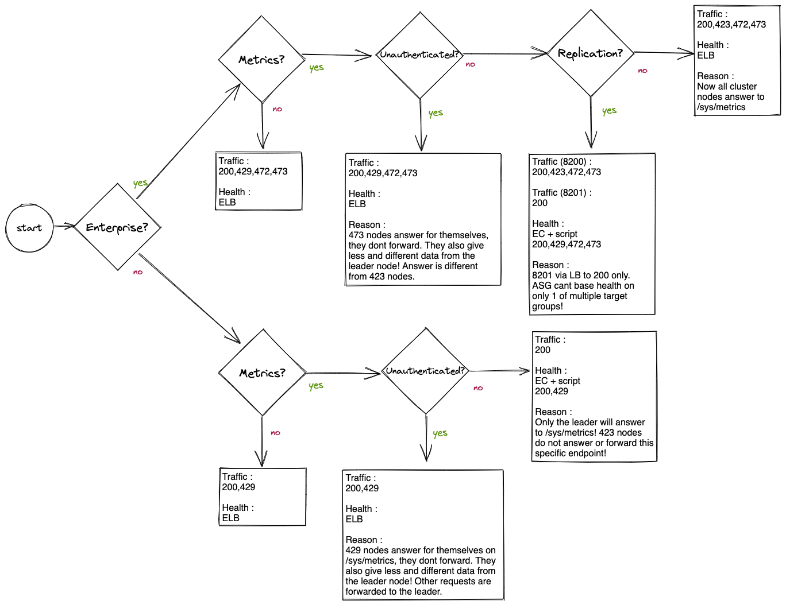

# Telemetry

You can enable telemetry in Vault by setting the variable `vault_enable_telemetry` to `true`.

Enabling this has a couple of effects:

- The `vault.hcl` is changed to include a telemetry stanza.
- The `vault.hcl` is changed to include configuration for (un)authenticated access to the metrics endpoint in the listener stanza.

Vault has a policy that prevents unauthenticated access to "/v1/sys/metrics". Setting `vault_enable_telemetry_unauthenticated_metrics_access` to `true`, allows anybody to access metrics on any Vault node. The side-effect is that any node will be used in the load balancing configuration, and ELB health checks can be used again for the auto-scaling group.

## Health endpoint HTTP return codes

The vault health endpoint will return these values under these conditions:

- "200": Raft leaders should not be replaced.
- "429": Raft standby nodes should not be replaced.
- "472": Nodes of Disaster recovery cluster should not be replaced.
- "473": Performance Standby nodes, should not be replaced.

See [documentation on the health endpoint](https://www.vaultproject.io/api-docs/system/health).

## ASG and loadbalancer health checking considerations

> TL;DR - Try to use ELB based health checking, because they reflect the health of the application. EC2 health checks do not consider how an application is running, just the health of the instance. So fall back to EC2 + "health check script" if ELB based health checking is not possible.

The AutoScalingGroup and loadbalancer both have health checking functionality.  
The loadbalancer uses HTTP return codes from a predefined API endpoint to determine which instances are ready to receive traffic.  
The AutoScalingGroup uses health checking to determine which instances are unhealthy and need to be replaced. By default the ASG bases its health checking on the EC health status of the instance. However this can be extended to include the health status of instance according to the loadbalancer. This way the ASG can replace instances where the application has issues but the OS and instance itself are still healthy.  

In situations where instances are intentionally not receiving traffic from the loadbalancer (i.e. cluster to cluster traffic on port 8201 or /sys/metrics in opensource Vault with unauthenticated metrics access true.), the ASG should not base its health checking on the loadbalancer as this would cause healthy instances to be replaced.

Wether the ASG should base its health checking on EC or LB; and which HTTP return codes the loadbalancer considers healthy can be found in the flowchart below.



## AWS custom health checking script

Any time EC based health checking is enabled for the ASG a custom AWS health checking script is also configured on the vault instances. This script performs health checking very similar to the loadbalancer. It checks the HTTP return codes from the /sys/health API endpoint for the instance that it runs on. When it receives an undesired HTTP return code the script will mark the instance unhealthy in AWS. This causes the instance to be replaced. Effectively this creates nearly the same quality health checking as when the ASG would base it on the ELB.

The custom AWS health checking script can be found in the userdata script. The script can also be seen on the vault instances as shown below:

```bash
[ec2-user@ip-172-16-2-71 ~]$ cat /usr/local/bin/aws_health.sh 
!/bin/bash

# Set variables
VAULT_STATUS_URL="https://<node_private_ip>:8200/v1/sys/health"
TIMEOUT=5

# Perform the health check
response=$(curl -k -m $TIMEOUT -s -o /dev/null -w "%{http_code}" $VAULT_STATUS_URL)

# Check the response code
case $response in
  200|429|472|473)
    aws --region eu-xxx-1 autoscaling set-instance-health --instance-id i-0123456789022f98e --health-status Healthy
  ;;
  *)
    aws --region eu-xxx-1 autoscaling set-instance-health --instance-id i-0123456789022f98e --health-status Unhealthy
  ;;
esac
```

## Load balancing considerations

With `vault_enable_telemetry` on, there are some limitations. Telemetry can only be served from the leader, unless `vault_enable_telemetry_unauthenticated_metrics_access` is on, in that case both leader and follower instances will serve their own instance specific telemetry data.

Having `any` or `leader only` has an effect on the auto scaling group:

- `ELB` OR `EC2` based health checking are used by the ASG to determine what instances are healthy.

ELB health checks are preferred in general.

## Testing

```shell
curl -k -H "X-Vault-Token: ${VAULT_TOKEN}" https://FQDN:8200/v1/sys/metrics
```
