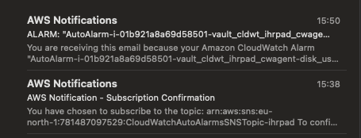

# Cloudwatch scenario for Vault

Spin up a HashiCorp Vault cluster with AWS Cloudwatch metrics, logs and alarms enabled.


## Setup

Prepare variables by creating your own `terraform.tfvars` in the `examples/cloudwatch` folder. It should look something like this:

```
domain  = "your.route53.domain.com"
region  = "us-east-1"
```

Initialise all terraform material.

```shell
terraform init
```

Create an ssh keypair.

```shell
test -f id_rsa.pub || ssh-keygen -f id_rsa
```

Generate a CA key and certificate.

```shell
./vault-tls.sh
```

## Alerting setup

The Cloudwatch alarms are configured when the `terraform apply` finishes succesfully.
Cloudwatch alarms when triggered will send a notification to a SNS Topic.
The last step is to subscribe to the SNS topic with your prefered method/protocol.
See [AWS Documentation](https://docs.aws.amazon.com/sns/latest/dg/sns-create-subscribe-endpoint-to-topic.html) for more details.

## Why you need to manually subscribe to the SNS Topic

Terraform CAN create SNS topic subscriptions. However AWS has a hard requirement for a real human to manually "confirm" any SNS topic subscription.
Likely to prevent spam and other kinds of abuse.

If Terraform creates the subscription for you and the subscription is not manually confirmed, Terraform CANNOT cleanup these resources with `terraform destroy`.
If the subscription has been manually confirmed Terraform has no issues cleaning up the resources.

Keep the above in mind if you plan on using the e-mail subscription example!

## Deploying

```shell
terraform apply
```

## Example: Create a SNS topic e-mail subscription

The AWS Documentation will show you how to do this in the AWS Webgui if you prefer to do it manually. This is how it can be done with Terraform:

Add to the examples/cloudwatch/main.tf:

```terraform
resource "aws_sns_topic_subscription" "example" {
  topic_arn = module.vault.cloudwatch_sns_topic_arn
  protocol  = "email"
  endpoint  = "example@example.com"
}
```

AFTER deploying with `terraform apply` in the next step, check your mailbox and confirm the subscription.
This has to be done before running `terraform destroy`, else terraform destroy will not clean up the subscription!

You will now receive email notification from the configured Cloudwatch alarms.



## Connecting to the bastion

The Terraform output will show you how to connect to the Bastion host.  
Note: If you want to use the bastion to connect to the Vault nodes `var.vault_allow_ssh` should be true AND then connect with SSH private key caching `ssh-add id-rsa; ssh -A ec2-user@bastion; ssh <ip-of-vault-node>`.